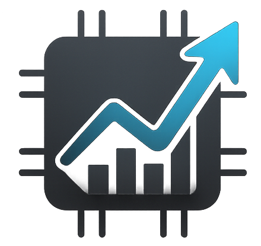

#  Eavest: Your Financial Portfolio Analyst

Eavest is a web application that helps you build, analyze, and project your investment portfolio. It uses data from Yahoo Finance and AI for insightful analysis and projections.

**Disclaimer:** This tool is for educational purposes only and is not financial advice. Consult a financial advisor before making investment decisions.

## Features

* **Portfolio Builder:** Add assets (stocks, commodities, bonds, indices, cryptocurrencies, and currencies) with custom allocations.
* **Portfolio Analysis:** View key metrics like portfolio value, allocation, average annual return, risk, and growth projections.
* **Market News:** Get summaries of relevant news affecting your portfolio assets.
* **Interactive Report:** Generates a visual report summarizing portfolio performance and projections.
* **AI-Powered Chat Assistant:** Ask questions about your portfolio analysis.

## Installation

1. **Clone the repository:** `git clone https://github.com/oscarhelmet/eavest.git`
2. **Create a virtual environment:** `python3 -m venv venv`
3. **Activate the virtual environment:** `source venv/bin/activate` (Windows: `venv\Scripts\activate`)
4. **Install dependencies:** `pip install -r requirements.txt`
5. **Configure environment variables:**
   * Copy the `.env.example` file to `.env` (or run `python export_env.py` to export your current environment)
   * Edit the `.env` file and set the following variables:
   * `GOOGLE_CLOUD_PROJECT`: Your Google Cloud Project ID.
   * `GOOGLE_CLOUD_LOCATION`: Your Google Cloud region (e.g., `us-central1`).
   * `GOOGLE_GENAI_USE_VERTEXAI`: Set to `True`.
     * `GOOGLE_APPLICATION_CREDENTIALS`: Path to your Google Cloud credentials JSON file.
6. **Run the application:** `python app.py` (Access at `http://0.0.0.0:3619`)

## Usage

1. Access the application in your web browser.
2. Use the "Portfolio Builder" to add assets and allocations.
3. Click "Analyse Portfolio" to generate the analysis and report.
4. Explore the tabs (Overview, Projections, Market News, Report) to view results.
5. Use the chat assistant to ask questions.

## Technical Specifications

* **Frontend:** HTML, CSS, JavaScript, Chart.js, Lodash, Marked
* **Backend:** Flask (Python)
* **Financial Data:** Yahoo Finance API
* **Natural Language Processing:** Google AI (Vertex AI)
* **Dependencies:** `flask`, `yfinance`, `requests`, `pandas`, `numpy`, `google-cloud-aiplatform` (and others - see `requirements.txt`)

## Contributing

Contributions are welcome! Please open an issue or submit a pull request.

## License

Apache-2.0 license

## Project Structure

The project is organized into a modular structure:

```
eavest/
├── app.py                  # Main application entry point
├── config.py               # Configuration settings
├── api/                    # API modules
│   ├── portfolio/          # Yahoo Finance portfolio APIs
│   ├── tech_analyze/       # Technical analysis APIs
│   ├── utils/              # Utility functions
│   │   ├── llm/            # LLM integrations
│   │   ├── helpers.py      # Helper functions
│   │   └── yahoo.py        # Yahoo Finance manager
│   └── routes.py           # Main web routes
├── static/                 # Static assets
│   ├── css/                # Stylesheets
│   ├── js/                 # JavaScript files
│   └── img/                # Images
├── templates/              # HTML templates
│   ├── base.html           # Base template
│   ├── index.html          # Home page
│   └── technical_analysis.html  # Technical analysis page
└── logs/                   # Log files
```

## API Endpoints

### Main Routes
- `GET /` - Home page
- `GET /technical-analysis` - Technical analysis page
- `POST /infer` - General inference endpoint for LLM queries

### Portfolio API
- `GET /api/yahoo-finance/chart` - Get historical chart data
- `GET /api/yahoo-finance/quote` - Get quote data

### Technical Analysis API
- `POST /api/technical-analysis` - Analyze chart images
- `POST /api/technical-analysis/draw` - Identify support/resistance levels
